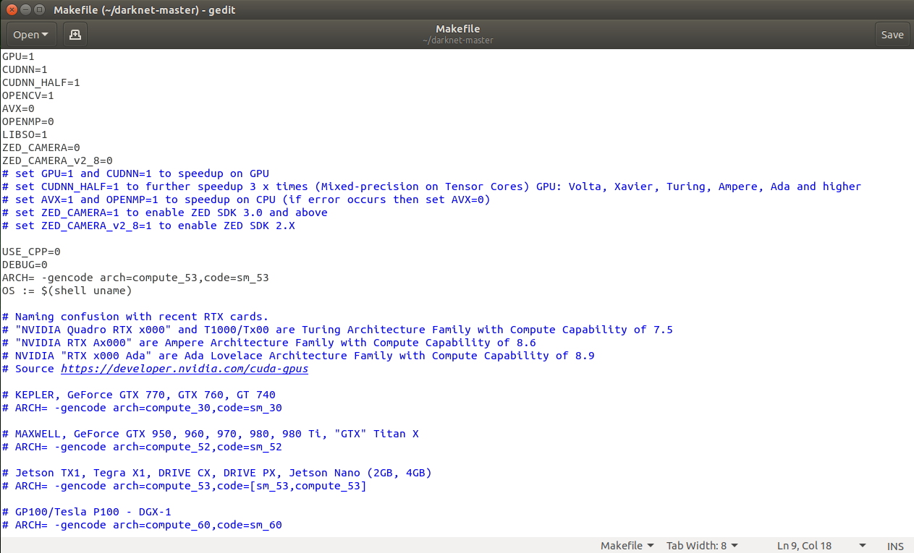
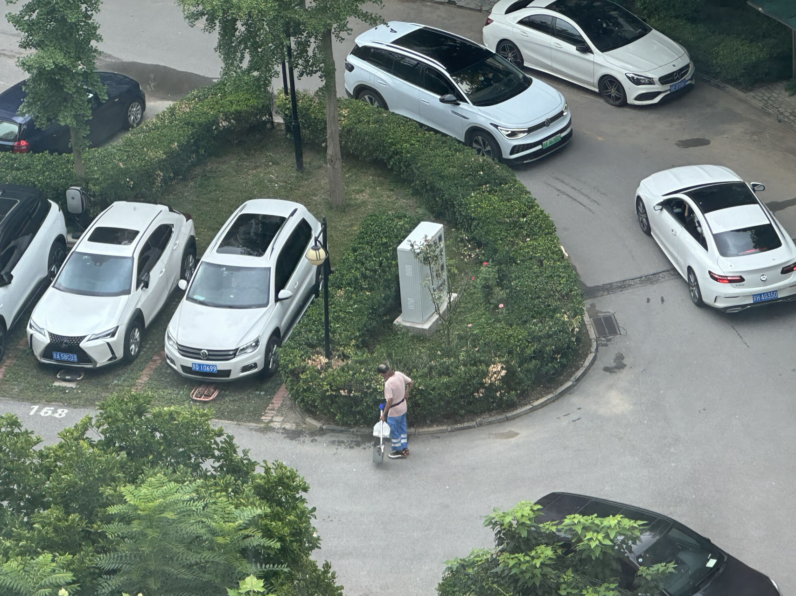
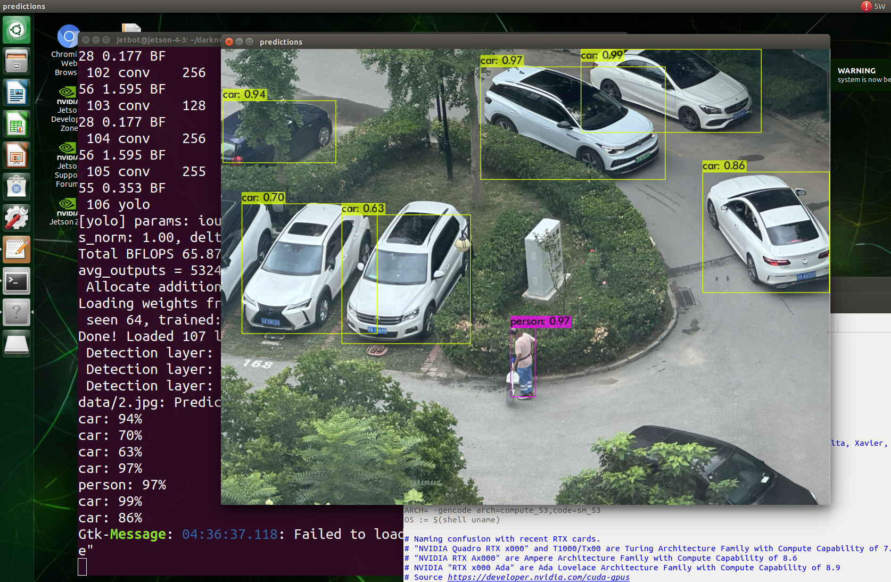

**Darknet** 是一个开源的神经网络框架，如Tensorflow及Pytorch一样，用于实现和训练深度学习模型，尤其是针对卷积神经网络（CNN）。它以其高效、轻量级和灵活的特点广受关注，最著名的应用就是 YOLO（You Only Look Once）系列的目标检测模型。特别适用于Jetson系列边缘计算平台。

### Darknet 的特点：

1. **轻量级和高效**：

   - Darknet 采用 C 语言和 CUDA 编写，具有较高的执行效率和较小的内存占用。这使得它能够在资源受限的设备上运行，如嵌入式系统。

   - 它支持 GPU 加速，通过 CUDA 和 cuDNN 可以显著提升深度学习模型的训练和推理速度。

2. **灵活性**：

   - Darknet 是一个相对较为轻量级的框架，用户可以根据需求对其进行修改和扩展。

   - 由于它采用了 C 语言实现，研究人员和工程师可以直接在底层代码中进行修改，以满足特定的需求。

3. **模块化设计**：

   - Darknet 采用模块化的设计，允许用户通过配置文件定义神经网络的结构。用户可以通过简单的配置文件来指定网络的各个层次，包括卷积层、全连接层、激活函数等。

   - 这种设计使得在 Darknet 中构建和训练不同的模型非常方便，无需编写大量代码。

4. **专注于计算机视觉**：

   - 虽然 Darknet 可以用于各种神经网络模型的开发，但它特别专注于计算机视觉任务，如图像分类、目标检测等。

   - YOLO 系列的目标检测模型（如 YOLOv3, YOLOv4, YOLOv7）就是基于 Darknet 构建的，这些模型因其实时性和高效性在计算机视觉领域广泛应用。

### Darknet 的结构与使用：

1. **配置文件**：

   - 用户可以通过 `.cfg` 文件来定义神经网络的结构和训练过程。这个文件中包含了网络的各层定义、激活函数类型、训练参数（如学习率、批次大小）等。

   - 例如，YOLOv3 的配置文件会定义模型的 Backbone（Darknet-53），以及用于检测的 Head 部分。

2. **预训练权重**：

   - Darknet 提供了许多预训练模型的权重文件，用户可以直接加载这些权重进行微调或推理。

   - 这些权重文件通常使用 `.weights` 格式保存。

3. **训练与推理**：

   - 通过命令行接口，用户可以轻松启动模型的训练和推理任务。Darknet 支持单 GPU 和多 GPU 的训练模式。

   - 用户也可以使用 Darknet 进行实时推理，例如在视频流上进行目标检测。

### 应用与影响：

Darknet 因其在 YOLO 系列模型中的核心角色而受到广泛关注。YOLO 模型以其实时性和高效性在许多实际应用中得到了广泛应用，包括视频监控、自动驾驶、机器人视觉等领域。

此外，Darknet 的轻量化和高性能也使其成为了嵌入式系统和移动设备上部署神经网络模型的一个选择。

总的来说，Darknet 是一个高效、灵活的深度学习框架，特别适合计算机视觉领域的研究与应用，尤其是在实时目标检测任务中。

在 Jetson Nano 上安装 Darknet 需要一些特定的配置，因为 Jetson Nano 是基于 ARM 架构的，并且使用 NVIDIA 的 GPU 加速。下面是详细的步骤来安装和配置 Darknet。

### 1. 更新系统和安装依赖项

首先，确保你的 Jetson Nano 系统是最新的，并安装一些基本的依赖项。

```bash
sudo apt-get update
sudo apt-get upgrade -y
sudo apt-get install build-essential git libopencv-dev -y
```

### 2. 安装 CUDA 和 cuDNN

Jetson Nano 自带 CUDA 和 cuDNN，你只需要确保它们是正确安装并可以使用的。

```bash
nvcc --version
```

这条命令会显示 CUDA 的版本信息。如果没有安装或配置错误，你需要按照 [NVIDIA 官方指南](https://developer.nvidia.com/embedded/jetpack) 进行安装。

### 3\. 克隆 Darknet 仓库

从 GitHub 克隆 Darknet 源代码：

```bash
git clone https://github.com/AlexeyAB/darknet.git
cd darknet
```

### 4\. 修改 Makefile

Darknet 的 `Makefile` 需要一些修改以支持 Jetson Nano 的 ARM 架构。使用以下命令打开 `Makefile`：

```bash
gedit  Makefile
```

然后修改以下几项：

```bash
GPU=1
CUDNN=1
OPENCV=1
ARCH= -gencode arch=compute_53,code=sm_53
```

注意：`compute_53` 和 `sm_53` 是用于 Jetson Nano 的正确架构设置。

此外，确保禁用 OpenMP 以避免与 Jetson Nano 的特定架构不兼容的问题：

```bash
OPENMP=0
```
修改如下图。


保存并退出编辑器。

### 5\. 编译 Darknet

在配置完成后，开始编译 Darknet：

```bash
make
```

这个过程可能需要几分钟到十几分钟，具体时间取决于你的 Jetson Nano 的性能。

### 6\. 测试安装

### 6-1. 下载 YOLOv3 的预训练权重文件 yolov3.weights

要下载 YOLOv3 的预训练权重文件 `yolov3.weights`，你可以按照以下步骤进行： 直接使用 `wget` 命令下载 在 Jetson Nano 的终端中，使用 `wget` 命令从官方的 YOLO GitHub 仓库下载 `yolov3.weights` 文件：

```bash
wget https://pjreddie.com/media/files/yolov3.weights
```

这个命令会将 `yolov3.weights` 文件下载到你当前的工作目录中。

### 6-2. 测试 Darknet 安装成功

编译完成后，你可以通过运行以下命令测试 Darknet 是否安装成功：

```bash
./darknet detect cfg/yolov3.cfg yolov3.weights data/car.jpg -thresh 0.5 
```

这将使用 YOLOv3 模型进行一次简单的目标检测测试。



执行结束并显示。



### 7\. 安装 Python 支持（可选）

大量的人工智能的项目适用了Python语言，为此打算在 Python 中使用 Darknet，可以安装 Python 绑定。

首先，安装 Python 依赖项：

```bash
sudo apt-get install python3-dev python3-pip
pip3 install numpy
```

然后，在 `Makefile` 中启用 Python 选项：

```makefile
PYTHON=1
```

再次运行 `make` 来编译 Python 绑定。重新编译后，将在新的darknet中内嵌一个python解释器、增加能被python调用的libdarknet.so动态库，可以使用下列命令。执行python程序。
```bash
./darknet detect.py cfg/yolov3.cfg yolov3.weights data/car.jpg -thresh 0.5 
```
### 8\. 开始使用

现在，Darknet 已经在你的 Jetson Nano 上成功安装并配置好，你可以开始进行训练或推理任务了。

### 注意事项

- 由于 Jetson Nano 的资源有限，在进行大型神经网络的训练时需要特别注意内存的使用情况。建议使用更小的模型，如 YOLOv3。

- 使用 Jetson Nano 时，最好插入一个额外的电源适配器（如 5V 4A），以确保设备在全负荷运行时能获得足够的电力。

安装完成后，你可以开始探索和使用 Darknet 进行各种计算机视觉任务了。
darknet开发框架内部组织结构、功能以及编程的详细介绍请参考本目录的“darknet开发框架的介绍”。
